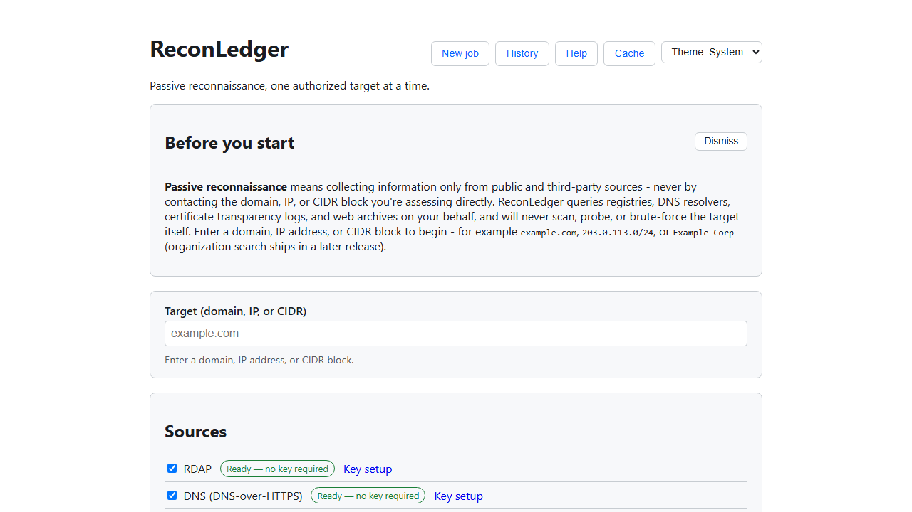
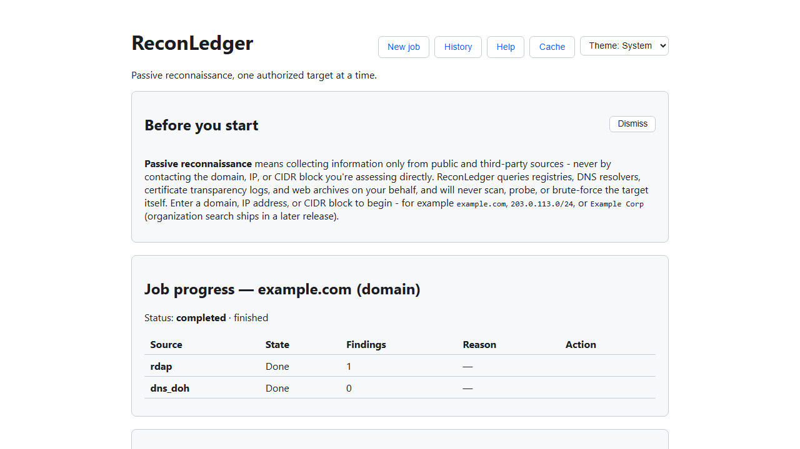
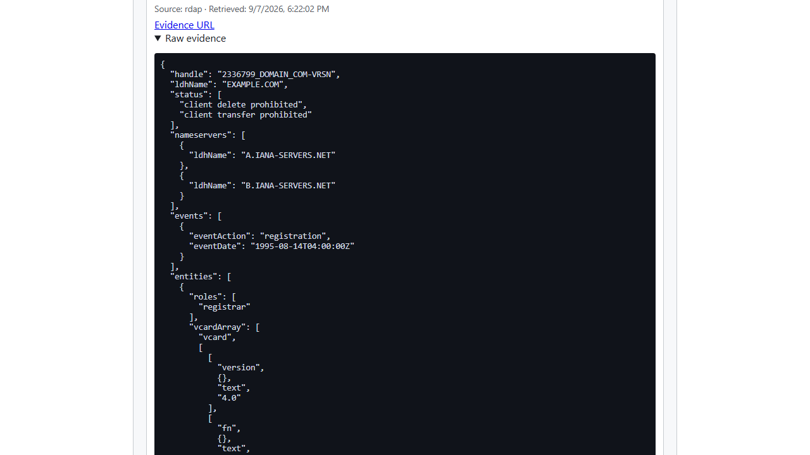
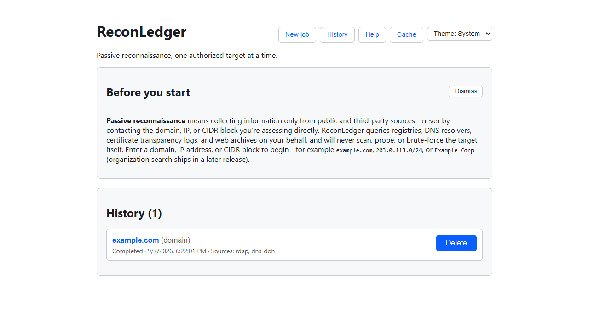
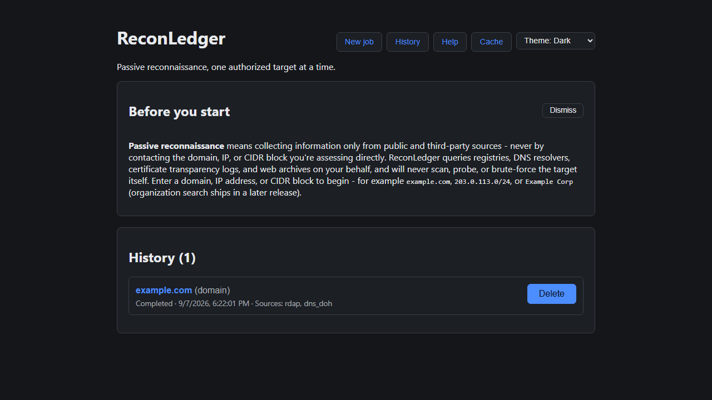

# ReconLedger

A local-first passive reconnaissance workbench for structured, repeatable, and citable OSINT.
FastAPI + SQLite on the backend, React + TypeScript on the frontend, no external services and
no database server to install.



## Authorized use only

ReconLedger is built only for domains, IP space, and organizations **you own or have written
authorization to assess**. Launching a job requires checking an explicit attestation to that
effect - it is recorded with the job and is not a formality.

Every source ReconLedger queries is a third-party or public data provider (domain/IP registries,
DNS resolvers, certificate transparency logs, web archives). **The application never sends a
single request to the target itself** - no port scan, no HTTP request to the target's own server,
no DNS query the target would ever see as traffic. This is a structural property of the codebase,
not a setting: a single [outbound gateway](backend/app/security/gateway.py) is the only object in
the process allowed to make a network call, it validates every destination against a per-job
deny-list seeded with the resolved target addresses before any collector runs, and a Playwright
test asserts the browser itself never issues a request toward the target either (favicons and
speculative connections included).

**We will not add active-scanning capability to this project** - no port scanning, no
vulnerability probing, no brute-forcing, no direct contact with a target's own infrastructure.
If you need that, it belongs in a separate, explicitly authorized lab project with its own scope
and controls - not bolted onto a passive OSINT tool.

See [docs/PRD.md](docs/PRD.md) for the full requirements, safety boundary, and architecture this
was built against, and [docs/VERIFICATION_WALKTHROUGH.md](docs/VERIFICATION_WALKTHROUGH.md) for a
real, recorded run through the acceptance walkthrough - including a real provider failure, a real
recovery via retry, and a real bug it caught along the way.

## What It Does

Enter a domain, IP address, or CIDR block you're authorized to assess, pick which sources to
query, and ReconLedger:

- Resolves registration data (RDAP), DNS posture (A/AAAA/MX/TXT/SPF/DMARC via DNS-over-HTTPS,
  cross-checked against two independent resolvers), certificate transparency history (crt.sh),
  and routing/ASN data (RIPEstat).
- Pulls archived URLs and parameters from the Wayback Machine and Common Crawl.
- Infers a technology stack from that already-collected evidence - never a new network call, and
  always with a link back to the finding it was inferred from.
- Aggregates every subdomain seen across sources into one filterable, exportable table.
- Lets you re-run the same target later and see an evidence-aware diff: additions, changes,
  removals, and an explicit "indeterminate" state when a source didn't complete in one of the two
  runs, so an incomplete run is never misreported as something disappearing.
- Keeps a local history of every job, deletable on demand, with a 90-day default retention sweep
  (and provider-response cache expiry) that runs automatically - never a manual chore.

Every finding carries its source, retrieval time, and raw evidence, and exports to Markdown,
JSON, and (for subdomains) formula-safe CSV.





## Sources and key setup

Every MVP source runs with **no API key or account required**:

| Source | What it provides |
|---|---|
| RDAP | Registration data (registrar, status, nameservers, key dates) |
| DNS-over-HTTPS | A/AAAA/CNAME/MX/NS/SOA/TXT, SPF, DMARC, cross-resolver agreement |
| crt.sh | Certificate Transparency - subdomains and certificate history |
| RIPEstat | Routing/ASN and network-block context for IP targets |
| Wayback Machine | Archived URLs and parameters |
| Common Crawl | Archived URLs and parameters from a second, independent archive |
| Technology inference | A stack inference derived from the other sources' own findings |

`GET /api/sources` (and the launch screen) report each source's live readiness. Keyed sources
(GitHub code search, Shodan/Censys, Have I Been Pwned domain search) are planned for a later
release and are not part of this build; an organization-name target is accepted but explicitly
explained as not yet assessable, rather than rejected as invalid input.

## Limitations

- **Passive only.** See "Authorized use only" above - this is a permanent design boundary, not a
  version-1 gap.
- **Domain, IP, and CIDR targets only** in this release; organization-name search (which needs
  keyed sources to be useful) is planned for a later release.
- **Human-layer and breach-data sources are not in this release.** They require stronger privacy
  controls (aggregate-by-default views, a verified-domain entitlement for breach data) that are
  intentionally sequenced after retention/deletion, which are already in place.
- **Single local SQLite database, one worker process.** This is a local workbench for one
  analyst, not a multi-tenant service - there's no concurrent-worker coordination.
- **crt.sh latency.** Certificate Transparency queries against a busy domain can be slow; the
  collector has an extended timeout and fails that one source cleanly (not the whole job) rather
  than blocking everything else.
- **No email, personnel, or breach data is collected in this release** - see the point above.

## How to Install

Requires **Python 3.11+** and **Node.js 20+**. No other global dependency, database server, or
account is needed - SQLite ships with Python, and every MVP source works without a key.

```bash
# Backend
cd backend
python -m venv .venv
.venv\Scripts\activate            # Windows; use `source .venv/bin/activate` on macOS/Linux
pip install -e ".[dev]"
alembic upgrade head
uvicorn app.main:app --reload     # http://127.0.0.1:8000
```

```bash
# Frontend, in a second terminal
cd frontend
npm install
npm run dev                       # http://localhost:5173
```

Everything is local: the SQLite database lands next to wherever the backend was started (override
with `RECONLEDGER_DATABASE_URL`; see [backend/.env.example](backend/.env.example) for every
setting and its default).

## Step-by-Step Instructions

With both servers running (above), using the app looks like this:

1. Open **http://localhost:5173** in a browser. The first-run panel explains the passive-only
   boundary; dismiss it or reopen it later from **Help**.
2. Enter an authorized target in the **Target** field - `example.com` and `203.0.113.0/24` always
   work for a test run, since they're IANA-reserved documentation space with real, public registry
   data behind them.
3. Under **Sources**, leave every MVP source checked (or narrow it down) - each shows its live
   readiness and needs no API key.
4. Check the **authorization attestation** checkbox. This is required; the button stays disabled
   without it.
5. Click **Launch job**. Progress streams in live, per source, with no indefinite spinner - a
   failed source shows its reason and the job still completes with whatever succeeded.
6. Once finished, review **Evidence** below: findings grouped by category, each with its source,
   retrieval time, and an expandable **Raw evidence** disclosure.
7. Use the **Subdomains** table to filter, copy, or download the aggregated list as CSV, and the
   evidence search box to find a specific nameserver, URL parameter, or ASN.
8. Download the **Markdown** or **JSON** export for a shareable report.
9. Open **History** to revisit or delete past jobs, or run the same target again to see cached
   sources complete instantly and use **Compare with an earlier run** for an evidence-aware diff.

## History, diff, and theme



Every job is kept in local history until it ages past the retention window or you delete it. Two
runs against the same target can be compared directly, and the whole interface respects your
system's light/dark preference or an explicit override, persisted across visits.



## Development

```bash
# Backend: lint, type-check, and the full test suite (no live network calls)
cd backend
ruff check .
mypy app
pytest

# Frontend: type-check, lint, and component tests
cd frontend
npm run typecheck
npm run lint
npm test
```

Two separate Playwright suites cover the browser end-to-end:

```bash
cd frontend
npm run test:e2e          # UX-12: real gateway, asserts the browser never contacts the target
npm run test:e2e:mocked   # happy path, partial failure, cached rerun, diff, history, keyboard, theme, downloads
```

`test:e2e` runs one check against the real internet and real provider data, and is intentionally
not part of CI (CI must never depend on live third-party services). `test:e2e:mocked` runs against
a scripted, fully deterministic backend and is the suite CI actually runs. Both boot the real
FastAPI app against a throwaway SQLite database - never your own `reconledger.db`.

CI (`.github/workflows/ci.yml`) runs the backend suite, the frontend suite, the mocked e2e suite,
a production frontend build, and a contract check that regenerates the OpenAPI schema and its
generated TypeScript client and fails if the committed copies have drifted - all without any live
network access.

## How It Works

- **Outbound gateway** (`backend/app/security/gateway.py`) - the single object allowed to make a
  network call. Pins every connection to its resolved IP before the request is sent, validates
  that IP against a per-job deny-list and against private/reserved ranges, follows redirects only
  to pre-approved hosts, and enforces per-provider timeouts, retry/backoff, and response caps.
- **Job runner** (`backend/app/jobs/runner.py`) - claims one queued job at a time, seeds the
  deny-list from the resolved target before dispatching anything, runs collectors with bounded
  concurrency, resumes cleanly after a crash, and runs the retention/cache-expiry sweep after
  every job finishes.
- **Collectors** (`backend/app/collectors/`) - one module per source, each declaring its own
  supported target types, required credentials (none, for MVP), rate policy, and cache policy
  against a shared plug-in contract.
- **Persistence** - SQLAlchemy + Alembic migrations (batch mode, for SQLite's ALTER limitations)
  over SQLite, with an FTS5 virtual table (and its sync triggers, written by hand - these can't be
  autogenerated) backing global search.
- **API** - FastAPI, typed request/response models, Server-Sent Events for live job progress.
- **Frontend** - React + TypeScript, a generated TypeScript client kept in sync with the backend's
  OpenAPI schema (see the contract-drift CI check above), no client-side routing beyond in-memory
  view state.

## License

MIT - see [LICENSE](LICENSE).
